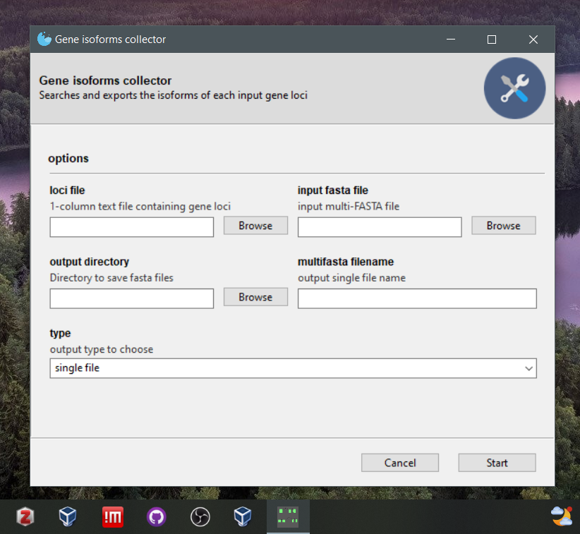

# Gene isoform collector
Windows and linux GUI and command line app that searches and exports the isoforms of each input gene loci

## Executables
executables can be found at  
## Citation
To cite this app cite the following:
1. Olga Tsiouri. (2023). Gene isoform collector: Windows and linux GUI and command line app that searches and exports the isoforms of each input gene loci. Zenodo. https://doi.org/10.5281/zenodo.7750822
2. Chris. (2023). Gooey [Python]. Retrieved from https://github.com/chriskiehl/Gooey (Original work published 2014)
3. Shirley, M. D., Ma, Z., Pedersen, B. S., & Wheelan, S. J. (2015). Efficient ‘pythonic’ access to FASTA files using pyfaidx (No. e1196). PeerJ Inc. [doi: 10.7287/peerj.preprints.970v1](https://peerj.com/preprints/970v1/) 
## Example data
The imput example data in `example/` are from [lotus base](https://lotus.au.dk/)